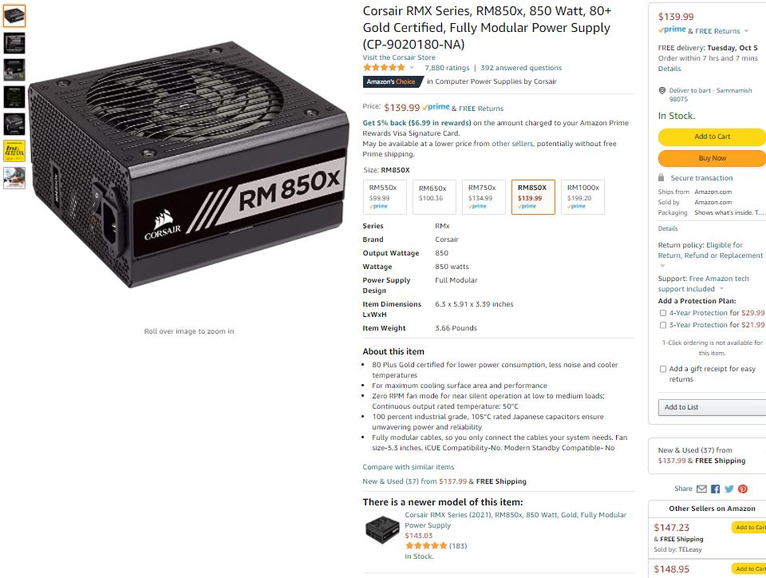
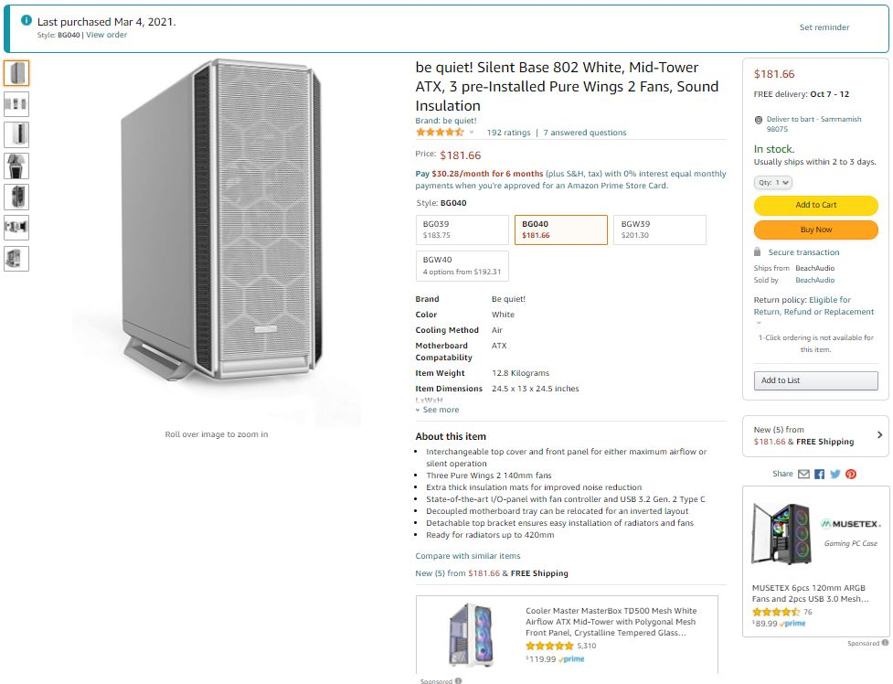
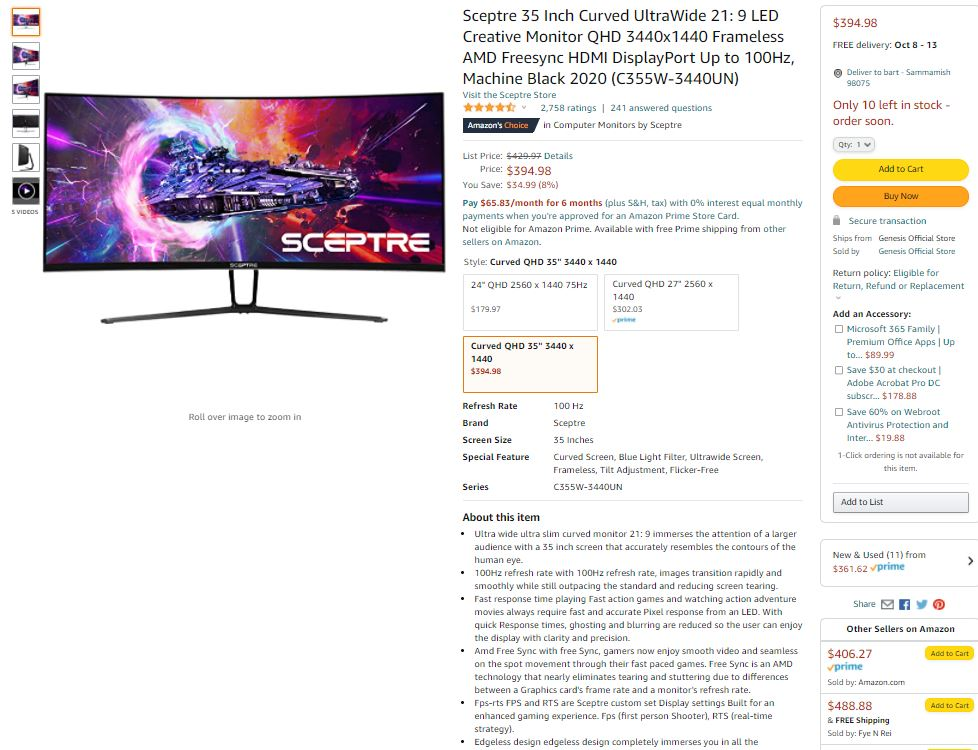
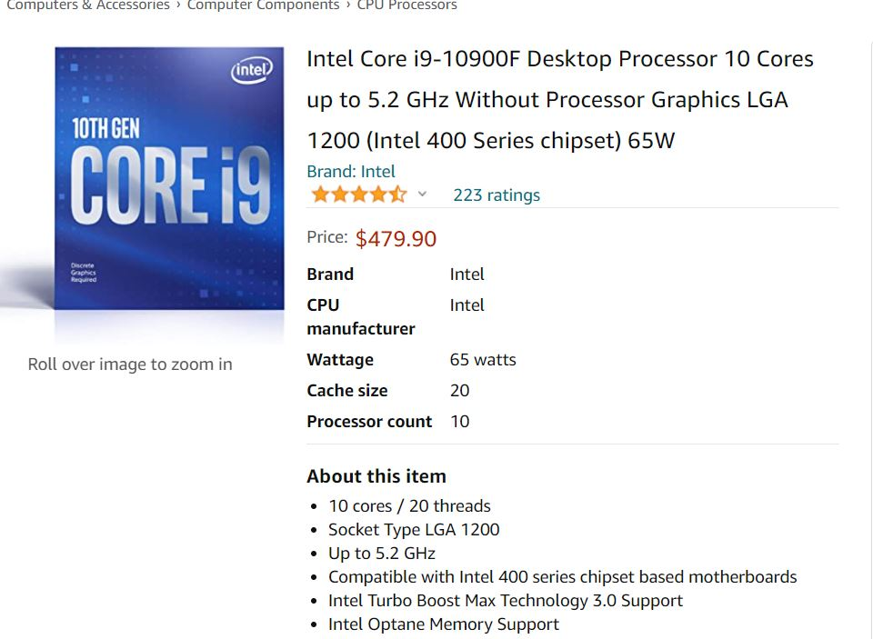
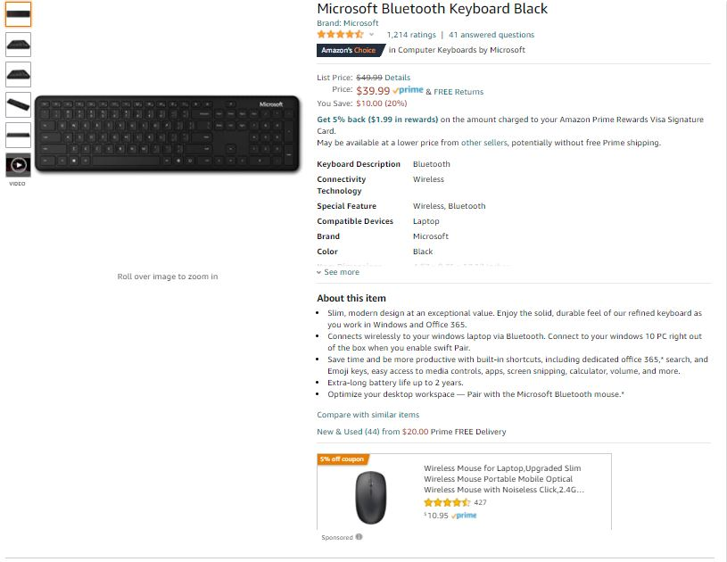

### Motherboard, $ 350

![amazon price]www.amazon.com/ROG-Gaming-Motherboard-Stages-Thunderbolt/dp/B08T6HTXF9/ref=asc_df_B08T6HTXF9/?tag=hyprod-20&linkCode=df0&hvadid=493040148899&hvpos=&hvnetw=g&hvrand=7227445321075050305&hvpone=&hvptwo=&hvqmt=&hvdev=c&hvdvcmdl=&hvlocint=&hvlocphy=9033330&hvtargid=pla-1185002396139&psc=1

### Power Supply, $ 140

![corsair amazon price]https://www.amazon.com/gp/product/B079H5WNXN/ref=ppx_yo_dt_b_asin_title_o00_s00?ie=UTF8&psc=1

### Case , $ 182

![amazon price, ]https://www.amazon.com/gp/product/B08NW4LD54/ref=ppx_yo_dt_b_asin_title_o08_s01?ie=UTF8&psc=1

### Display, $ 395

[display price amz]https://www.amazon.com/gp/product/B0812DKDD9/ref=ppx_yo_dt_b_search_asin_title?ie=UTF8&psc=1

### CPU,  $ 480                       

[cpu Intel Core i9-10900 Desktop Processor 10 Cores up to 5.2 GHz LGA 1200 (Intel 400 Series Chipset) 65W : Amazon.ca: Electronics]https://www.amazon.ca/dp/B086ML4XSD?tag=uig0c-20&linkCode=ogi&th=1&psc=1 

### Hard Drive 1 ,$    180 + 111

[hard drive 1 TB - M.2 NVMe Interface Internal Solid State Drive, 4 TB NAS ] https://www.amazon.com/gp/product/B07BN217QG/ref=ppx_yo_dt_b_asin_title_o08_s00?ie=UTF8&psc=1

https://www.amazon.com/gp/product/B07H289S79/ref=ppx_yo_dt_b_search_asin_title?ie=UTF8&psc=1

### keyboard/mouse, $   40 + 23

[Amazon.com: NEW Microsoft Mobile Mouse - Pastel Blue](https://www.amazon.com/gp/product/B086QQ59GC/ref=ppx_yo_dt_b_asin_title_o00_s00?ie=UTF8&psc=1)

[Amazon.com: Microsoft Bluetooth Keyboard Black : Electronics](https://www.amazon.com/gp/product/B07Y3ZS47V/ref=ppx_yo_dt_b_search_asin_title?ie=UTF8&psc=1)

### CPU Cooler, $140

[Amazon.com: Thermaltake Water 3.0 ARGB Motherboard Sync Edition AMD /Intel LGA1200 Ready 240 All-in-One Liquid Cooling System 2X 120mm High Efficiency Radiator CPU Cooler CL-W233-PL12SW-A : Everything Else](https://www.amazon.com/gp/product/B07N17HZN2/ref=ppx_od_dt_b_asin_title_s00?ie=UTF8&psc=1)

### DDR4 [ use existing 32 GB]

### Total: **$2041**

