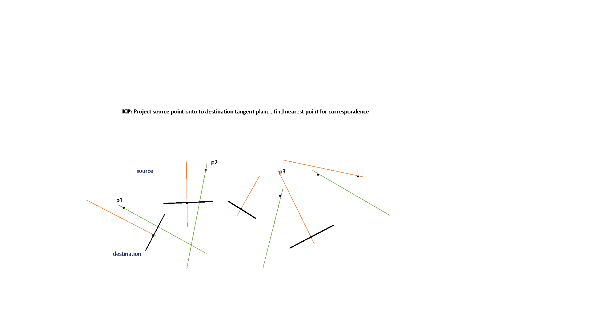

###  bartPublic

<!-- Just one possible MathJax CDN below. You may use others. -->

$$\sum_{i=1}^n X_i$$
🎃🍇🌋🗾🏝️🍎🍔🏄⛷️🕴️🤼‍♀️💡🧮🎥🪕

\(begin{vmatrix}a & b\\
c & d
\end{vmatrix}=ad-bc\)

$$y-y_0=m(x-x_0)$$

\(∀x_0∀ε>0∃δ>0∋{|x-x_0|}&lt;δ⇒{|f(x)-f(x_0)|}&lt;ε\)

\frac{d🍎}{dt}$
		                         
\frac{3}{7}

BAH public GIT repo.  Currently test a few gifs for video , charts, etc using markdown.

  * Github markdown has problem with equation render.  

<iframe src="https://giphy.com/embed/3orieUDCwLUFf6zFzW" width="70" height="70" frameBorder="0"   ></iframe>
Copy Code

